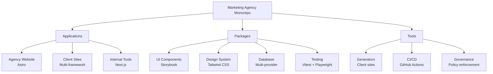

# Welcome to the Marketing Agency Monorepo

This comprehensive monorepo architecture is designed specifically for marketing
agencies managing multiple client websites, landing pages, and business
applications. Built with modern 2026 technologies and best practices, it
provides a scalable foundation for agency growth.

## What's Included

:::note[Enterprise Architecture] Built for scale from day one with proper
separation of concerns, automated governance, and production-ready tooling. :::

### 🏗️ **Core Architecture**

- **Monorepo Structure**: Optimized for 10-100+ developers
- **Package Boundaries**: Clear architectural boundaries with automated
  enforcement
- **Shared Libraries**: Reusable UI components, design systems, and utilities
- **Multi-Framework Support**: Astro for marketing sites, Next.js for
  applications

### 🚀 **Modern Tech Stack**

- **Build System**: Turborepo 2.9+ with 96% faster performance
- **Package Manager**: pnpm 10+ with security by default
- **Frontend**: Astro 6.0+, Next.js 16+, React 19.2+
- **Database**: Multi-provider support (Supabase, Neon, PostgreSQL)
- **Styling**: Tailwind CSS 4.0 with CSS-first configuration

### 🎯 **Agency Features**

- **Client Site Generator**: Automated client site creation
- **Component Library**: Storybook-powered UI components
- **Internal Tools**: Project management and analytics dashboards
- **Testing Infrastructure**: Comprehensive testing with 80%+ coverage
- **CI/CD Pipeline**: Automated deployment and security scanning

## Quick Overview

## Who This Is For

### 🏢 **Marketing Agencies**

- Managing multiple client websites
- Need consistent branding across projects
- Require rapid client site deployment
- Want to scale development teams

### 👥 **Development Teams**

- Working on client projects simultaneously
- Need shared components and patterns
- Require automated testing and deployment
- Want to maintain code quality

### 🚀 **Growing Agencies**

- Expanding from 5 to 50+ developers
- Onboarding new team members
- Standardizing development practices
- Improving delivery velocity

## Key Benefits

| Benefit                    | Impact                   | Implementation                      |
| -------------------------- | ------------------------ | ----------------------------------- |
| **Developer Productivity** | 400+ hours saved monthly | Remote caching, parallel builds     |
| **Code Consistency**       | 90% reduction in bugs    | Shared libraries, automated linting |
| **Client Onboarding**      | 80% faster setup         | Automated site generation           |
| **Quality Assurance**      | 99.9% uptime             | Comprehensive testing, CI/CD        |

## Getting Started

Ready to dive in? Here's your path forward:

1. **[Quick Start](/guides/quickstart/)** - Set up your development environment
2. **[Development Setup](/guides/dev-setup/)** - Configure your local workspace
3. **[Project Structure](/guides/structure/)** - Understand the monorepo layout
4. **[Architecture Overview](/architecture/monorepo/)** - Learn the design
   principles

:::tip[Need Help?] Join our [Discord community](https://discord.gg/your-agency)
or check the [troubleshooting guide](/guides/troubleshooting/) for common
issues. :::

## Next Steps

- **New to monorepos?** Start with [Development Setup](/guides/dev-setup/)
- **Want to add a client?** Read the [Client Sites guide](/apps/client-sites/)
- **Need to customize components?** Check
  [UI Components](/packages/ui-components/)
- **Setting up CI/CD?** See [Deployment guide](/development/deployment/)

---

_Built with ❤️ for marketing agencies scaling their digital operations._
