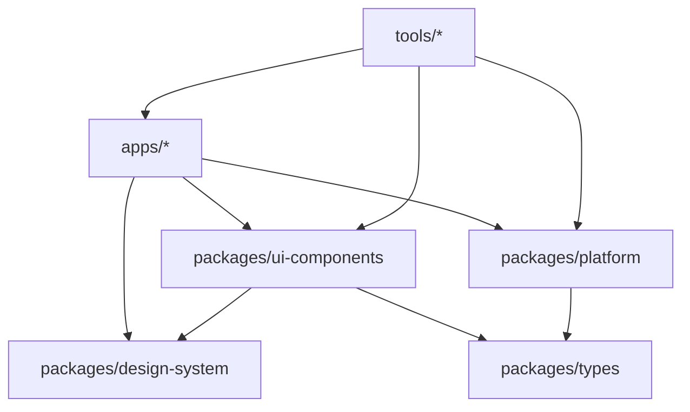

# Developer Onboarding Guide

Welcome to the marketing agency monorepo! This guide will help you get up to
speed with our codebase, workflows, and best practices.

## Before You Start

### Prerequisites

- **Experience**: 2+ years of web development experience
- **Skills**: TypeScript, React, Node.js, Git
- **Tools**: VS Code, pnpm, Docker (optional)
- **Time**: 2-3 days for complete onboarding

### What You'll Learn

1. **Monorepo Architecture** - How our codebase is organized
2. **Development Workflow** - Daily development practices
3. **Code Standards** - Our coding conventions
4. **Testing & Quality** - How we maintain code quality
5. **Deployment** - How code gets to production

## Day 1: Environment Setup

### Morning (2 hours)

#### 1. Repository Setup

```bash
# Clone the repository
git clone https://github.com/your-org/marketing-agency-monorepo.git
cd marketing-agency-monorepo

# Install dependencies
pnpm install

# Copy environment configuration
cp .env.example .env.local
```

#### 2. IDE Configuration

Install VS Code extensions:

```bash
code --install-extension ms-vscode.vscode-typescript-next
code --install-extension esbenp.prettier-vscode
code --install-extension dbaeumer.vscode-eslint
code --install-extension bradlc.vscode-tailwindcss
```

Configure VS Code settings (see [Development Setup](/guides/dev-setup/)).

### Afternoon (3 hours)

#### 3. First Run

```bash
# Start all development servers
pnpm run dev

# You should see:
# - Agency Website: http://localhost:3000
# - Project Manager: http://localhost:3001
# - Storybook: http://localhost:6006
# - Documentation: http://localhost:4321
```

#### 4. Explore the Codebase

```
marketing-agency-monorepo/
├── apps/                    # Applications
│   ├── agency-website/      # Main marketing site
│   └── internal-tools/      # Internal tools
├── packages/                # Shared code
│   ├── ui-components/       # Reusable components
│   ├── design-system/       # Design tokens
│   └── platform/            # Core packages
└── tools/                   # Development tools
```

## Day 2: Understanding the Architecture

### Morning (3 hours)

#### 1. Monorepo Concepts

**What is a monorepo?** A single repository containing multiple projects and
packages.

**Why we use it:**

- Shared code and components
- Consistent tooling and standards
- Atomic commits across projects
- Simplified dependency management

#### 2. Package Boundaries

Understanding our package architecture:



**Key Rules:**

- Apps can depend on packages
- Packages have clear boundaries
- No circular dependencies
- Use workspace references (`workspace:*`)

### Afternoon (3 hours)

#### 3. Technology Stack

**Frontend:**

- **Astro 6.0+**: Marketing sites and content
- **Next.js 16+**: Interactive applications
- **React 19.2+**: Component framework
- **Tailwind CSS 4.0**: Styling system

**Backend:**

- **Supabase**: Database and auth
- **Neon**: Alternative database
- **PostgreSQL**: Native database option

**Tooling:**

- **Turborepo 2.9+**: Build system
- **pnpm 10+**: Package manager
- **Vitest**: Unit testing
- **Playwright**: E2E testing

#### 4. Design System

Our design system includes:

- **Colors**: Consistent color palette
- **Typography**: Font scales and styles
- **Spacing**: Layout spacing system
- **Components**: Reusable UI components

Explore the [design system documentation](/packages/design-system/).

## Day 3: Development Workflow

### Morning (3 hours)

#### 1. Daily Development

**Starting work:**

```bash
# Pull latest changes
git pull origin main

# Start development servers
pnpm run dev

# Run tests in background
pnpm run test:watch
```

**Making changes:**

```bash
# Create feature branch
git checkout -b feature/new-component

# Make changes...

# Run quality checks
pnpm run lint:fix
pnpm run type-check
pnpm run test

# Commit changes
git add .
git commit -m "feat: add new component"
git push origin feature/new-component
```

#### 2. Code Standards

**Naming conventions:**

- Components: `PascalCase`
- Files: `kebab-case`
- Variables: `camelCase`
- Constants: `UPPER_SNAKE_CASE`

**File organization:**

```
ComponentName/
├── ComponentName.tsx      # Main component
├── ComponentName.test.tsx # Tests
├── ComponentName.stories.tsx # Storybook
├── index.ts              # Exports
└── README.md             # Documentation
```

### Afternoon (3 hours)

#### 3. Component Development

**Creating a new component:**

```bash
# Generate component scaffold
pnpm run new:component MyComponent

# This creates:
# packages/ui-components/src/atoms/MyComponent/
# ├── MyComponent.tsx
# ├── MyComponent.test.tsx
# ├── MyComponent.stories.tsx
# └── index.ts
```

**Component template:**

```tsx
import React from 'react';
import { cn } from '@/utils/cn';
import { designTokens } from '@agency/design-system';

interface MyComponentProps {
  children: React.ReactNode;
  className?: string;
  variant?: 'primary' | 'secondary';
}

export const MyComponent: React.FC<MyComponentProps> = ({
  children,
  className,
  variant = 'primary',
}) => {
  return (
    <div
      className={cn(
        'base-class',
        variant === 'primary' && 'primary-styles',
        variant === 'secondary' && 'secondary-styles',
        className
      )}
    >
      {children}
    </div>
  );
};
```

#### 4. Testing

**Unit tests:**

```tsx
import { render, screen } from '@testing-library/react';
import { MyComponent } from './MyComponent';

describe('MyComponent', () => {
  it('renders children', () => {
    render(<MyComponent>Test</MyComponent>);
    expect(screen.getByText('Test')).toBeInTheDocument();
  });

  it('applies variant styles', () => {
    render(<MyComponent variant="secondary">Test</MyComponent>);
    const element = screen.getByText('Test');
    expect(element).toHaveClass('secondary-styles');
  });
});
```

**E2E tests:**

```tsx
import { test, expect } from '@playwright/test';

test('component renders correctly', async ({ page }) => {
  await page.goto('/components/my-component');
  await expect(page.locator('.base-class')).toBeVisible();
});
```

## Week 1: First Contributions

### Task 1: Bug Fix (1-2 days)

**Choose a good first issue:**

- Look for `good first issue` labels
- Small, well-defined scope
- Involves existing code

**Process:**

1. Understand the problem
2. Write tests to reproduce
3. Implement fix
4. Add tests
5. Update documentation
6. Submit PR

### Task 2: Small Feature (2-3 days)

**Example: Add loading state to Button component**

1. **Research**: Check existing Button implementation
2. **Design**: Add loading prop and spinner
3. **Implement**: Update component and stories
4. **Test**: Add unit and visual tests
5. **Document**: Update component docs

### Task 3: Documentation (1 day)

**Improve documentation:**

- Fix typos and grammar
- Add missing examples
- Improve code comments
- Update README files

## Ongoing Development

### Daily Workflow

1. **Standup**: Update team on progress
2. **Development**: Work on assigned tasks
3. **Code Review**: Review team PRs
4. **Learning**: Explore new features

### Weekly Workflow

1. **Planning**: Sprint planning and task estimation
2. **Retro**: Process improvement discussion
3. **Learning**: Tech talks and knowledge sharing
4. **Housekeeping**: Dependency updates and cleanup

### Best Practices

#### Code Quality

```bash
# Before committing
pnpm run lint:fix
pnpm run format
pnpm run type-check
pnpm run test

# Before creating PR
pnpm run build
pnpm run test:e2e
```

#### Git Hygiene

```bash
# Good commit messages
feat: add user authentication
fix: resolve button click issue
docs: update API documentation
test: add component tests
refactor: optimize database queries

# Branch naming
feature/user-auth
fix/button-click
docs/api-update
```

#### Performance

- Use React.memo for expensive components
- Implement proper loading states
- Optimize images and assets
- Monitor bundle size

## Getting Help

### Resources

- **Documentation**: [Full docs site](http://localhost:4321)
- **Component Library**: [Storybook](http://localhost:6006)
- **API Reference**: [TypeDoc docs](/api/)
- **Architecture**: [Design docs](/architecture/)

### Team Communication

- **Discord**: Daily discussions and questions
- **GitHub Issues**: Bug reports and feature requests
- **Code Reviews**: PR feedback and discussions
- **Meetings**: Weekly planning and retro

### Troubleshooting

**Common issues:**

- Environment setup problems
- Build failures
- Test failures
- Deployment issues

**Where to get help:**

1. Check documentation
2. Search existing issues
3. Ask in Discord
4. Create issue with details

## Success Metrics

### First 30 Days

- [ ] Complete environment setup
- [ ] Ship first bug fix
- [ ] Contribute to code review
- [ ] Understand architecture
- [ ] Write documentation

### First 90 Days

- [ ] Ship feature independently
- [ ] Mentor new developer
- [ ] Improve development process
- [ ] Contribute to architecture
- [ ] Present knowledge to team

## Next Steps

After completing onboarding:

1. **Explore Specialization**: Choose an area to focus on
2. **Deep Dive**: Learn specific technologies
3. **Contribute**: Make meaningful contributions
4. **Mentor**: Help new team members
5. **Innovate**: Improve processes and tools

---

## Welcome to the Team!

We're excited to have you join us! This monorepo represents our commitment to
quality, scalability, and developer experience. Your contributions will help us
build amazing products for our clients.

Remember: **We're all learning together**. Don't hesitate to ask questions,
suggest improvements, and challenge the status quo.

**Happy coding!** 🚀

---

_Last updated: April 2026_  
_Maintained by: Development Team_
